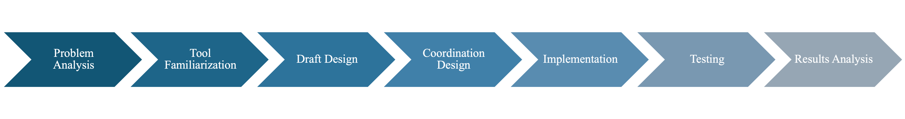

# Introduction

Multi-Agent Systems (MAS) represent a significant domain in contemporary
artificial intelligence research. In a MAS, multiple decision-making
agents interact within a shared environment, pursuing common or
conflicting objectives. A MAS comprises agents---computational entities
or a combination of humans and agents---collaborating with each other
and the environment to achieve specified goals. It's acknowledged that
agents may lack complete knowledge of both the environment and the
internal states of other agents within the system.

Interaction between agents is a crucial feature facilitating the
utilization of knowledge from other agents, enabling a rapid
understanding of the environment. This interaction can take on
cooperative or competitive forms. In cooperation, agents collaborate
toward shared goals, aiming to distribute and share knowledge while
leveraging each other's intelligence to solve problems.

The system's focus is on simulating the treasure hunt problem, employing
different types of agents to optimize exploration and treasure
collection. The world is represented as an undirected graph, and agents
must cooperate and coordinate to navigate the map efficiently,
considering time constraints and completing sub-tasks.

In this final delivery we will outline the complete implementation of
the proposed multi-agent system for the treasure hunt problem. We will
present the final architecture, and agent designs. We will also go over
communication, coordination and cooperation approaches.

# Methodology

A structured and collaborative methodology was used to ensure a
successful project outcome. Our approach included a series of key
activities, underpinned by regular team meetings to facilitate effective
communication and decision making. The meetings consisted of discussing
the current status of the project and the next steps. A list of tasks
was then created and divided among the group.

To carry out this methodology, we used several tools, some more
management-oriented and others more implementation and code-oriented.

## Management Tools

**GitHub**

To facilitate code management for the project, GitHub is a web-based
platform designed for version control and collaborative software
development. It allows developers to host and manage their code
repositories, track changes, and collaborate seamlessly. The entire
project is uploaded to a GitHub repository, allowing each team member to
contribute independently.\
\
**Google Drive**

A cloud-based file storage and sync service. Google Drive from Google
allows users to store files in the cloud, access them across devices,
and collaborate on documents in real-time. As a cloud storage platform,
it serves as a repository for reports, presentations, and other
project-related documents. During meetings, Google Drive is used to
create files for new tasks and assignments.\
\
**Google Meet**

Google Meet, a video conferencing platform, facilitates virtual
meetings, video conferences, and webinars. Developed by Google, it
supports real-time communication with features such as high-quality
video and audio, screen sharing, and chat functionality. Google Meet is
the tool of choice for conducting team meetings.

## Coding Tools

**IntelliJ IDEA**

As an integrated development environment (IDE) for coding and project
development, IntelliJ IDEA is specifically tailored for Java
development. Developed by JetBrains, it offers advanced coding tools,
intelligent code assistance and a user-friendly interface. Known for its
robust features, IntelliJ supports various frameworks and technologies
essential for this project.\
\
**Java**

The primary programming language for the project, Java is known for its
versatility and object-oriented nature. Initially chosen because the
template is in Java, its platform independence becomes critical when
dealing with multi-agent systems with different dependencies and
configurations.\
\
**JADE [@jade]**

JADE (Java Agent DEvelopment Framework) is an open source platform for
peer-to-peer agent-based applications. Implemented entirely in Java, it
simplifies the creation of multi-agent systems by adhering to the FIPA
specifications. JADE provides middleware and graphical tools for
debugging and deployment .\
\
**Dedale [@dedale]**

Dedale, initiated and maintained by members of the MAS research group at
the LIP6 Computer Science Laboratory, aims to improve experimental
evaluation conditions for MAS algorithms. Focusing on decentralization
in real-world scenarios, Dedale addresses multi-agent problems beyond
simple setups.

## Roadmap

<!--  -->

1.  **Problem Analysis:** Conducted a comprehensive analysis to
    thoroughly understand the project requirements and challenges.

2.  **Tool Familiarization:** Download, prepare the project template,
    and familiarise with the new environment and IDE.

3.  **Draft Design:** Developed an initial design outlining agent
    properties and defining their interactions. Selected and preproced a
    suitable map, and strategically distributed treasures.

4.  **Coordination Design:** Reviewed and revised the initial design to
    enhance coordination among project components.

5.  **Implementation:** Executed the project plan, translating the
    design into a tangible solution.

6.  **Testing:** Rigorously tested the implemented solution to identify
    and address any issues or potential improvements.

7.  **Results Analysis:** Analyzed the testing results to assess the
    effectiveness of the implemented solution and to inform future
    iterations or enhancements.

# Multi-Agent System design

## Environment

### Environment Properties

In this section, we will go into more formal detail regarding the
environment specification. The proposed environment for the treasure
hunt simulation is represented by an undirected graph. Uniquely
identified nodes represent different locations that are connected by
edges or paths which agents may use to move from one node to another.
Nodes may house safes that contain the treasure that we aim to find.

The proposed environment has the following characteristics
[@wooldridge2009]:

-   **Initially partially observable**, but as agents explore and
    collaborate they may eventually construct a complete map of the
    environment through collaboration.

-   **Deterministic**, as any action will have a single guaranteed
    effect.

-   **Dynamic**, since there are multiple agents acting over it an agent
    cannot assume that because it performed no actions between t1 and t2
    that the environment will be the same. However, agents may assume
    node-local static behaviour, since only one agent may enter a node
    or edge at a time, and there are no other sources of dinamicity than
    agents' actions.

-   **Discrete**, since there is a fixed number of possible environment
    states.

-   **Non-episodic**, since the current decisions of agents will affect
    the current time-step and future ones.

### Map Design

The map was based on the city of León in Spain. It was cleaned so that
there were only 547 nodes. Additionally, new paths were drawn in to
guarantee that the map was represented by a biconnected graph.
Biconnected graphs are a special case of connected graphs. A connected
graph is one in which there is at least one path between any pair of
points, while a biconnected graph strengthens connectivity by requiring
that there are at least two different paths to reach a node. Using a
biconnected graph presents advantages such as reducing the risk of
deadlocks by reducing the odds of two agents having to cross the same
path simultaneously. Additionally, it makes coordination between agents
more flexible, increases chances for exploration, and reduces
bottlenecks by providing redundant connectivity.

Safes with treasure were placed along the map following the specified
amounts for both gold and diamonds in the requirements for the practical
work. They were scattered semi-randomly across the map. Some were placed
completely randomly while others were placed in spots considered
challenging to reach by the team. Figure
[2](#fig:map_new){reference-type="ref" reference="fig:map_new"} shows
the map used for the environment and the location of the treasures.

{#fig:map_new width="50%"}

## Architecture

The design of a multi-agent system in charge of simulating a treasure
hunt problem requires a structured and efficient architecture to manage
the interaction of the different agent roles and to optimize the
collective achievement of the overall objectives. In this section, we
present the General Architecture of our multi-agent system, which
comprises a hierarchy of agents and coordination mechanisms. This
decision is supported by the explanations of different types of
architectures in [@palau2019multiagent].

Our architectural framework is structured into two hierarchical layers,
each serving distinct roles in the system. At the top level, we have the
coordinators, which, as the name implies, function as intermediaries
between the lower-level agents. In contrast, the lowest level includes
the operational agents, the entities tasked with solving the intricacies
of the treasure-hunting problem. These working agents represent the core
workforce responsible for performing the actual problem-solving tasks.

This design framework allows for better interaction between the various
agents, ensuring that the multi-agent system works coherently and
cooperatively pursuing the goal of optimizing treasure collection while
dealing with the complexities of an unfamiliar map and locked safes.

Key points about our hierarchical structure are:

1.  **Clear division of labor and responsibilities.** With this
    hierarchical structure, we seek to have a well-defined division of
    labor and responsibilities among the different types of agents. With
    this, we want each type of agent to know their role and tasks within
    the system, so that redundancy and overlapping of tasks are reduced
    while optimizing the use of resources.

2.  **Clear division of knowledge.** It is not viable in most cases for
    all agents to have complete knowledge of the environment state since
    that would require a deadlock-prone shared structure. The
    introduction of manager agents allows for better bookkeeping without
    causing issues for the lower-level agents. This is the backing of
    the blackboard subsystem that will be described in section
    [4.3.1](#blackboard){reference-type="ref" reference="blackboard"}.

3.  **Top-level coordination.** The coordinators play a crucial role as
    brokers. They can communicate hints to the low-level agents
    according to the needs of each state of the environment.

4.  **Focus and Adaptability of Regular Agents.** The regular agents at
    the bottom of the hierarchy are very reactive, this allows them to
    quickly adapt to unexpected obstacles, such as deadlock problems,
    however, this also causes issues since they only experience a very
    localized section of the environment. The managers help reduce the
    impact of this agent characteristic by providing more proactive
    reasoning.

We initially considered a three-layer hierarchical design for our
architecture, with a general coordinator as the top layer, which was
discarded later on, due to the complexity of agent communication.
Recognizing an excessive number of coordinators and unnecessary
complexity and centralization, we simplified the structure to a more
efficient two-layer model. This decision struck a balance between
simplicity and functionality, in keeping with the straightforward nature
of the treasure-hunting problem we were trying to solve.

## Agent definition

Within the hierarchical architecture of our multi-agent system for the
treasure hunting problem depends on the unique roles and capabilities of
the agents in the environment. These agents must explore the unknown
map, collect treasure, and coordinate their efforts efficiently. In this
section, we provide a concise definition of the types of
agents---Explorers, Collectors, and Tankers---specifying their type,
attributes, responsibilities, assigned tasks, and utility functions.

There are three required types of agents: Explorers, Collectors, and
Tankers. Additionally, we added coordinator agents. Many different
classifications can be done between the agents to explain their
specifications.

The proposed architecture is shown in the figure
[3](#fig:arch){reference-type="ref" reference="fig:arch"}

{#fig:arch
width="60%"}

### Top-Level Agents

The Coordinator role is responsible for overseeing the progress
throughout the entire simulation. It must maintain communication in
order to know the status updates of the environment and to be able to
record the progress being made, the resources used, and in general the
performance of the system in the resolution of the task. Moreover, it is
responsible for the communication between the bottom-level agents, they
act as mediators. The attributes for the coordinator agents are shown in
Table [\[tab:coordinator\]](#tab:coordinator){reference-type="ref"
reference="tab:coordinator"}.

Responsibilities:

-   Maintaining a focus on long-term global objectives.

-   Keeping track of discovered treasures, and their state.

-   Maintaining statistics.

-   Facilitating communication between agents: Receiving and processing
    requests or updates from bottom-level agents, and updating the
    blackboard as a response.

-   Mobilizing the agents to treasure spots when necessary.

### Bottom-Level Agents

Bottom-level agents are the ones that perform the core tasks of
exploring, collecting, and transporting treasures. These agents are
classified as collaborative agents as they must interact and cooperate
between them and with the coordinator to achieve the given goals. The
proposal for these agents is to focus on a lightweight, reactive
architecture for quick responses and robustness.

Responsibilities:

-   Executing specific tasks related to their roles as described in the
    general definition.

-   Reacting to changes in the environment.

-   Go to the locations the coordinators require them to travel to.

-   Collaborating with other agents and coordinators as necessary.

Their general definition is as follows:

-   **Collectors**.

    -   Their main goal is to transport treasures to the tankers, which
        will receive all of the treasure the collectors are carrying
        when they come within range.

    -   Can carry a limited amount of either gold or diamonds, depending
        on their configuration. Moderate lock-picking and strength.

    -   With the help of explorers and coordinators, they should travel
        to the most treasure-dense areas.

    -   They should communicate with coordinators to update the current
        environment status.

-   **Tankers**.

    -   Their main goal is to store all the collected treasure.

    -   Can carry large amounts of both gold and diamonds. They have no
        strength or lock-picking skills.

    -   They may move freely over the map, however they should ideally
        be near the most treasure-dense areas.

-   **Explorers**.

    -   Their primary goal is to systematically explore the unknown
        terrain, constructing a comprehensive map of the environment

    -   They have high lock-picking and strength, however they have no
        carrying capacity.

    -   They should communicate with managers to update the current
        environment status.

The attributes for bottom-level agents are presented in Table
[\[tab:simple\]](#tab:simple){reference-type="ref"
reference="tab:simple"}, and were selected in accordance with the
project description.

# Multi-agent system coordination and communication

## Problem decomposition

The treasure hunting problem is a challenge where problem division is
important to ensure efficiency, especially when considering a
multi-agent approach. This division allows us to address different
aspects of the challenge in a specific way, and identify diverse
necessary tasks such as the exploration of the map, the collection of
the treasure and the roles of the agents. By dividing the problem we
allow each sub-problem to be addressed in a simpler, and more structured
way.

1.  **Map exploration:**

    -   **Goal:** Discover the unknown map efficiently to identify
        nodes, edges, and possible treasure locations.

    -   **Method:** We will use Dedale's predefined ExplorerCoop agent
        together with a blackboard for knowledge sharing with managers,
        that may then send agents to new locations based on this
        information.

    -   **Challenges:** Understand Dedale's implementation in order to
        craft other agents around it. Implement a new manager agent
        definition, treasure objects and blackboard solution.

2.  **Treasure Collection:**

    -   **Goal:** Optimize treasure collection by ensuring efficient
        routes and coordination between agents.

    -   **Method:** Coordinating agents will interact with lower level
        agents to identify the optimal agent to unlock/collect a
        treasure based on their location and skills. Assign Collector
        and Explorer agents the task of opening safes and collecting
        treasure, collaborating with Tanker agents for storage.

    -   **Challenges:** Locked safes, varied skills needed to open them,
        and the need to make decisions based on the state of the
        environment.

3.  **Communication and Information Sharing:**

    -   **Goal:** Establish an effective communication dynamic between
        agents to share map updates, treasure locations, and routes
        between specific points as necessary.

    -   **Method:** Take advantage of Dedale's predefined sharing
        techniques, include a black board for information-sharing.

    -   **Challenges:** Limited scope of communication, potential
        information overload, and coordination complexities.

4.  **Deadlock Management:**

    -   **Goal:** Avoid deadlocks, especially in scenarios where agents
        cannot exchange positions, and manage them when they arise.

    -   **Method:** Apply a strategy based on random movement to free
        agents from deadlocks.

    -   **Challenges:** Limited maneuverability in confined spaces and
        possible conflicts in the coordination between agents.

## Task sharing - ContractNet

The Contract Net [@smith1980contractnet] has been chosen as the main
mechanism for the task sharing between agents, as it can be integrated
perfectly for the problem and the architecture of the multi-agent system
proposed. Such system fits perfectly because the tasks in which the
problem is divided can be easily defined and solved using this contract
based system and the roles defined can be accommodated to our
multi-agent system by giving the coordinators the manager role and the
low-level agents the contractors role. Also, the implementation for this
system is available in JADE, which eases the implementation process.
These contracts would begin once a coordinator receives a notification
from either an explorer or an agent via the subscription method which
will be explained later on the document.

For every task that has to be completed during the treasure hunt, the
coordinator receiving the notification will begin the process
established by the contract net protocol:

-   The coordinator recognizes the task that has to be performed
    depending on the notification received.

-   The coordinator announces the task to the corresponding agents in
    its communication range.

-   Each of the agents that receives the announcement decides if they
    want to do the task and if so, they bid by submitting a tender.

-   Based on the messages received from the agents, the coordinator
    decides which is the best based on a cost function and assigns the
    task to such agent, rejecting the others.

After the process has been defined, two types of contracts that
coordinators will create are explained below. Each of the contracts has
a cost function, which will be used by the coordinator to decide which
agent/s it will assign the task to:

Note that the contractors are explorers and/or collectors for the first
contract, which means that a combination of agents can be chosen
regardless of their type. On the other hand, for the second contract,
collectors and tankers are defined as contractors as one agent of each
type has to be selected.

$$C = d + \alpha(lp_a - lp) + \beta(s_a - s)$$

$$C = d$$

[]{#tab:values label="tab:values"}

Notes on functions:

-   The cost function depends on the distance between the objective node
    and the current node and additionally, since the possible
    contractors have different lock-picking and strength attributes, the
    cost function is designed to take if possible, the agent for which
    the difference between its attributes and the safe requirements is
    the lowest possible in order to complete the task with the bare
    minimum, leaving agents with larger capabilities free for other
    tasks.

    Also, for a combination of agents, the cost function would take as
    parameters the sum of the parameters for each individual agent, so
    that each parameter would look like the following:

    **d:** sum of distances from each agent to the objective node

    $lp_a:$ sum of lock-picking attribute of each agent

    $s_a:$ sum of strength attributes of each agent

-   Since in this case all of the contractors have the same attributes,
    the distance is the only parameter included in the function.

However, a contract might be not feasible for any agent within the
coordinator's radius. Therefore, a broadcasting option will be defined
for the coordinators:

Coordinators will act similar to a proxy server, if they can find an
agent within their radius able to complete the corresponding task, they
will choose the best one and wait for the task to be completed. However,
if they cannot find any agent within its communication radius able to
perform the task, they will broadcast a message to all the coordinators
in its range defining the task and asking each one of them for an agent
that can complete it and its cost. Finally, after comparing the cost of
each of the options received, an agent will be chosen and it will
perform the task.

Also, since it may happen that an agent receives an offer while
completing another task, when bidding for a contract, such agent will
indicate that it is indeed doing another task and the cost remaining for
such task so that the total cost of performing the new one will be the
sum of the new one plus the remaining of the current one.

## Results sharing

A key challenge we need to tackle is how well the agents are informed
globally about their progress in obtaining the treasure.

### Blackboard

Implemented as a centralized global list accessible to manager agents
that will store the found treasures' node ID, lock state, total weight
and type. Explorers and collector will communicate with the manager who
will update this data structure on an as-available basis.

This is the definition of the Treasure class:

-   id: The node containing the treasure.

-   maxAmount: The total amount of gold or diamonds in the treasure.

-   state: If the treasure has been is locked, unlocked or collected.

-   type: The treasure has gold or diamond.

The blackboard itself was implemented as an expansion of Dedale's
predefined MapRepresentation.java implementation by making such object a
Singleton and adding a treasure list as one of its attributes.

## Social Norms

The goal of coordination is to solve the problem of inter-dependencies
between the activities of agents. Additionally, coordination in
multiagent systems poses an interesting additional challenge, it must
happen at run time, which means agents must be capable of recognizing
the relationship between their actions and managing them as part of
their activities. Another important thing to note is that for our
project we will use offline designs, in which social laws are hardwired
into agents (Woolridge, 2009).

In our case, the most obvious example of an inter-dependency between
agents' actions is the deadlock problem, in which no two agents may
enter the same node or traverse the same edge simultaneously, so they
depend on each other's movement to be able to move. (Woolridge, 2009).

### Deadlock Handling

According to von Martial's typology of coordination relationships, we
can identify the relationship that causes the deadlock problem as a
negative relationship of competition over a non-consumable resource,
since the presence of agent *a* on a node or edge *loc* is incompatible
with the presence of agent *b* in *loc*, but one may use *loc* after the
other has left. (von Martial, 1990)

We will handle deadlocks internally within each agent. Each agent will
check if the node it want to travel to is occupied, if it is not, it
will advance. Otherwise, it will use random movement repeatedly until it
gets out of the deadlock.

The reasoning behind using this function is that it reduces message
passing amongst agents, which in turn increases the system´s
independence. It allows agents to handle deadlocks independently and
without a manager´s intervention. In this way, we increase agent
autonomy. Finally, this approach was also selected due to its
intuitivity and ease of implementation.

Smarter approaches with priority functions could be used, however this
would increase the amount of message-passing, and communication cost
could eventually become a bottle-neck. This particular issue could also
be solved by using coordination by mutual modeling, but it would require
more mathematical modeling which entails its own challenges. For our
small-scale model using a social norm should work well enough.

### Proactive Lock-Picking

In Von Martial's typology of relationships, an agent proactively opening
any locked safeboxes it finds along the way exploits a non-requested
positive relationship. This is due to the fact that sometimes an agent
may have the lock-picking skill and strength required to open a safe, so
although opening the lock will not immediately be beneficial to that
agent, it can help the collective goal without any significant overhead.
This is why, whenever possible, an agent will lockpick any treasure box
it encounters. (von Martial, 1990)

The activities of opening the safe and collecting the treasure don't
need to be strictly coordinated, since the system can wait for an agent
or group of agents who can both open the safe and carry the treasure to
arrive. However, by proactively opening it, an agent may save time by
facilitating the retrieval of the treasure later on, which increases the
overall utility. This behaviour was implemented for all agents with
lock-picking skills.

### Send Tanker to the Collector that Needs it

When a collector is picking a treasure, it will stay in that spot until
the treasure has been cleared. However, this is only useful if there is
a tanker agent within range, otherwise the collector would only stay by
the treasure without actually collecting any more of it. When this
happens, the tanker agent will be proactively sent to the correct
location by the manager agent, so that the entire treasure can be
collected on one go, minimizing the number of movements the collector
has to make.

### Explorer Lock-picking after Mapping

After finishing the mapping, the manager will send explorers to the
treasures that have not been opened yet according to the blackboard.
This way the explorer agents still have tasks to accomplish after
mapping, and they are not idling, and we can more efficiently open the
treasures with higher lock-picking and strength values.

# Implementation

## Changes from the coordination design and final considerations

In the final step of our development process, we conducted a thorough
reconsideration of the coordination and communication design presented
on previous deliverables. Notably, the role of the coordinator as a
mediator was discontinued, as the publish/subscribe method introduced
complexities in communication that proved challenging to overcome.
Despite this change, coordinators retained their organizational role,
tasked with structuring tasks and providing directives to the low-level
agents.

To facilitate an unified approach, the map representation has been
streamlined into a singleton, ensuring that all coordinators and agents
operate with the same map instance. This promotes consistency and avoids
discrepancies in spatial understanding among different components of the
system. In Java, a singleton is a design pattern that restricts the
instantiation of a class to ensure that it has only one instance and
provides a global point of access to that instance.

Additionally, the list of treasures has been designated as a global
variable accessible to all coordinators, and it is editable by the
explorers. Such list contains information about the treasures discovered
by the explorer agents, including the node where it is, its type or the
state of the treasure.

Also, since the social norms of proactive lock-picking and lock-picking
after exploration are implemented, there is no need to make use of a
contract network to organise agents for the opening of treasure safes.
This means that in the end the contract network is only used for the
collection of treasures and only involves collectors as contractors. And
since only one manager is being used, no message forwarding is
performed.

Finally, we are working with just one coordinator.

## Agent behaviours

While each agent shares a common basic behavior in terms of movement and
properties, each agent is assigned different tasks that introduce
significant variations in their roles.

Before delving into the specifics of each agent's behavior, certain
considerations were taken into account. In particular, the movement
patterns of the agents have evolved beyond pure randomness. In contrast
to the initial approach, agents are now restricted from revisiting their
previous nodes, preventing backward movement and introducing a more
purposeful exploration strategy.

As deadlocks occur when an agent is unable to move in the direction it
wants, a behavior modification is included in order to cause a random
movement for a few ticks if the agent is unable to move due to a
deadlock.

### Explorer

The primary role of explorer agents is to actively generate knowledge
about the map and facilitate information sharing with other agents.
These explorers maintain a representation of the world they traverse,
creating a graph representation of the map as they explore. As they
navigate the environment, explorer agents meticulously record the nodes
they visit, contributing to the comprehensive map graph. At the same
time, they keep track of the treasures they find, noting their exact
locations on the map.

Upon encountering a treasure, an explorer agent dynamically updates its
status to \"found\" and identifies the location node where the treasure
is located.

In addition to exploring, all explorers have the unique ability to pick
locks, a skill that is determined by the values of their respective
traits. Once the exploration phase is complete, the explorer agents
transition to the pick-lock phase, using their acquired knowledge and
skills to further optimize the treasure hunt scenario.

This is the algorithm that follows these agents:

::: algorithm
::: algorithmic
Get the current position of the agent. Observe the surrounding nodes and
their observations. Mark the current node as closed in the map.

Add the node to the map. Add the edge between the current node and the
accessible node. Consider it as the next node to move to.

Print a success message. Move randomly to another location. Select the
next move:

Move to it. Choose one from the open node list, compute the shortest
path, and move to the first step of the path.
:::
:::

### Collector

The discovery of a treasure triggers a dynamic process in which the
nearest collector agent quickly travels to the location of the treasure.
Once at the location, the collector proceeds to pick up the treasure.
The collector then assumes a standby position until a tanker agent
enters the communication range. The transfer of the treasure takes place
when the collector and the tanker are in the same communication range.

This is the algorithm that follows these agents:

::: algorithm
::: algorithmic
Get the current position of the agent Observe the surroundings and get a
list of observations at the current position (*lobs*) Pick up the
treasure Try to store everything in the tanker Print a message
indicating stored treasure in the tanker Send message to manager and
explorers to update treasure's state Choose a random move from the
current position that is different from the previous one Move to the
selected location
:::
:::

### Tanker

This is the algorithm that follows these agents:

::: algorithm
::: algorithmic
Wait for the next tick (every 5 seconds). Obtain next message from the
message queue Check the message content (Protocol must be
\"MoveTanker\") Ask to an explorer or manager for the path to the node
contained in the message Move towards the node following the path
obtained.
:::
:::

### Coordinator

The coordinator has two main responsibilities: running the contractNet
to manage tasks, and sending messages to the agents.

When a treasure is discovered, the coordinator initiates action by
dispatching the nearest collector to the treasure's location. Once a
collector has successfully retrieved the treasure, the coordinator takes
over again. He issues instructions to send a tanker to the collector's
current location. At the same time, the collector remains stationary and
waits for the tanker to arrive.

These are the algorithm that follows these agents:

::: algorithm
::: algorithmic
Wait for the next tick (every 10 seconds). If the map representation is
not initialized, retrieve the instance. Get the list of unlocked
treasures from the map. Create a Contract Net Protocol (CFP) message to
send to potential varying responders (agents c1, c2 or c3, c4 depeneding
on the treasure type). Set the protocol of the message as
FIPA_CONTRACT_NET. Set the reply-by date for the message to 7.5 seconds
from the current time. Set the id of the node as content of the message
as the string representation of the treasure. Add a ContractNetInitiator
behavior to the agent to handle the contract net interaction.
:::
:::

::: algorithm
::: algorithmic
Wait for the next tick (every 300 milliseconds). If the map
representation is not initialized, retrieve the instance. Receive an
ACLMessage from the agent's message queue. Update the state of the
specified treasure to unlocked in the map and reply with a confirmation.
Extract treasure IDs from the message content. Get the shortest path
from the first treasure to the second. Create a reply message with the
path content. Add the sender of the original message as the receiver.
Set the conversation ID and protocol of the reply message. Send the
reply message with the shortest path to the sender. Send a null message.
Send message to tankers with the node to the collector that needs help
:::
:::

## Map Representation

Functions related to map representation, focusing on the definition of a
graph, have been implemented in the project template. Building on this
foundation, additional functionality is integrated to improve the
organization of the treasure within the system.

::: tcolorbox
**Implemented methods:**

-   `addTreasure(id, amount, type)`: Adds a new treasure with a given
    ID, amount, and type.

-   `unlockTreasure(id)`: Unlocks a treasure with the specified ID.

-   `checkUnlocked(id)`: Checks if a treasure with the specified ID is
    unlocked.

-   `updateTreasure(id)`: Updates the state of a treasure with the
    specified ID to \"COLLECTED.\"

-   `getUnlockedTreasures()`: Returns a list of unlocked treasures.

-   `getTreasures()`: Returns a list of all treasures.
:::

## Overview

The global flowchart [4](#fig:flux){reference-type="ref"
reference="fig:flux"} provides a panoramic view of system dynamics and
encapsulates the overall process. Agents are represented by different
colors: blue for explorers, green for collectors, red for tankers, and
gray for the coordinator.

{#fig:flux
width="\\textwidth"}

# Results

As the agents explore and gather treasure in the environment, the
following metrics were kept:

-   Amount of gold obtained.

-   Amount of diamonds obtained.

-   Number of movements per agent needed to complete the treasure hunt.

These metrics will be used to evaluate the performance of our system.

In our runs, we found that the highest possible amount of gold and
diamonds was gathered. This is possible due to the contract net and
manager coordination. Without these methodologies gathering the 100 gold
and 100 diamond treasures was almost impossible since it depended on two
agents being within range of each other and the treasure at the same
moment randomly. Gathering the other treasures took between 20 and 30
minutes in most cases with a tickrate of 200ms, which is far from ideal
as well. When these two tools were introduced performance increased
greatly. In comparison, the multi agent system implemented completed the
treasure hunt within **2 minutes** approximately, with a 30 units of
communication range.

Additionally, we found that all the involved agents moved an average of
**500 times** (over 5 executions). This result may seem a bit strange,
however, it is due to the fact that an agent is never static. As seen in
the code, an agent without an explicit mission will continue to move
randomly, which explains the even divide of the steps. This behaviour is
good since it foments exploration, however, if there were any physical
constraints to consider, such as gas cost or time of travel, it might be
better to use a utility function that punishes unnecessary movements.

<figure id="Maps">
<figure id="Init_map">

<figcaption>Initial Map</figcaption>
</figure>
<figure id="fin_map">

<figcaption>Final Map</figcaption>
</figure>
<figcaption>Initial and final maps comparison</figcaption>
</figure>

# Future Work

Our work in the current project of multi-agent systems within the JADE
environment has opened up exciting options for further research.
Building upon the foundations of this project, several possible
directions emerge, offering opportunities to dive deeper into the
complexities of intelligent agent interactions and contribute to the
evolving landscape of artificial intelligence.

Enhance Agent Behaviors: As a natural progression, future work could
focus on refining and expanding agent behaviors. Investigating more
complex decision-making processes, learning mechanisms, and social norms
would contribute to a more sophisticated representation of intelligent
agents, making them better equipped to navigate diverse and dynamic
scenarios.

Integration of Machine Learning Techniques: Incorporating machine
learning techniques into the behavior of intelligent agents can elevate
the adaptability and predictive capabilities of the system. Future work
could explore the integration of reinforcement learning, or other
advanced machine learning methodologies to empower agents with the
ability to autonomously improve their decision-making over time.

Scalability and Performance Optimization: Addressing the scalability of
the JADE environment is crucial for simulating larger and more complex
multi-agent systems. Future efforts could be directed toward optimizing
the performance and exploring techniques to handle a higher volume of
agents and interactions while maintaining efficiency.

Real-World Applications: Transitioning from simulation to real-world
applications represents a challenge. Future research could involve
adapting the JADE environment for practical use cases, such as
optimizing the flow of robots in a warehouse, coordinating autonomous
vehicles, etc. This transition would require addressing real-world
uncertainties and complexities in dynamic environments and with agent
interactions in much more complex scenarios.

In summary, our current project sets the first step for many possible
scenarios of future work on a more complex and interesting level. By
pushing the boundaries and extending our exploration into these
suggested areas, we anticipate contributing to the advancement of
multi-agent systems and their practical applications in artificial
intelligence.

# Conclusions

The implementation of this project in the multi-agent systems field has
provided us with a practical platform to apply the theoretical concepts
learned throughout the course. We successfully defined the environment,
agents, and their behaviors, and created the interactions and common
goals within the JADE framework. The project allowed us to understand in
a practical way how multi-agent systems operate in simulated scenarios
with the complexities and advantages of agent communication and
cooperation mechanisms, to adapt and collaborate effectively.

Throughout the entire development, we encountered many challenges
associated with the different possible configurations of the project
such as the levels of hierarchy, number of coordinators, range of
communication, etc. that led us to test iteratively multiple approaches
to solve optimally the main goal, ending up with a different approach
that the one that we considered in the early design stage.

However, this journey of multiple iterations in the implementation has
been an enriching experience, solidifying our foundation in multi-agent
systems. We finish this project with a deeper appreciation for the
challenges and possibilities presented by intelligent agents working
together, and we look forward to applying these skills in future and
more challenging endeavors.
#### Project Requirements & Specifications

This work is a research project, more details of the project can be found on the p[roject website](http://golem.iimas.unam.mx/home.php?lang=en&sec=home) and in [this article](https://scholar.google.nl/scholar?oi=bibs&cluster=16368582091687832750&btnI=1&hl=fr). Details on ask behavior can be found in this article presented at CEIAAIT 2019. 

